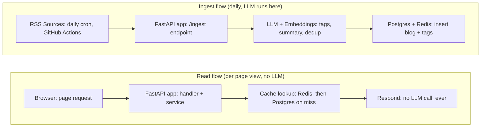
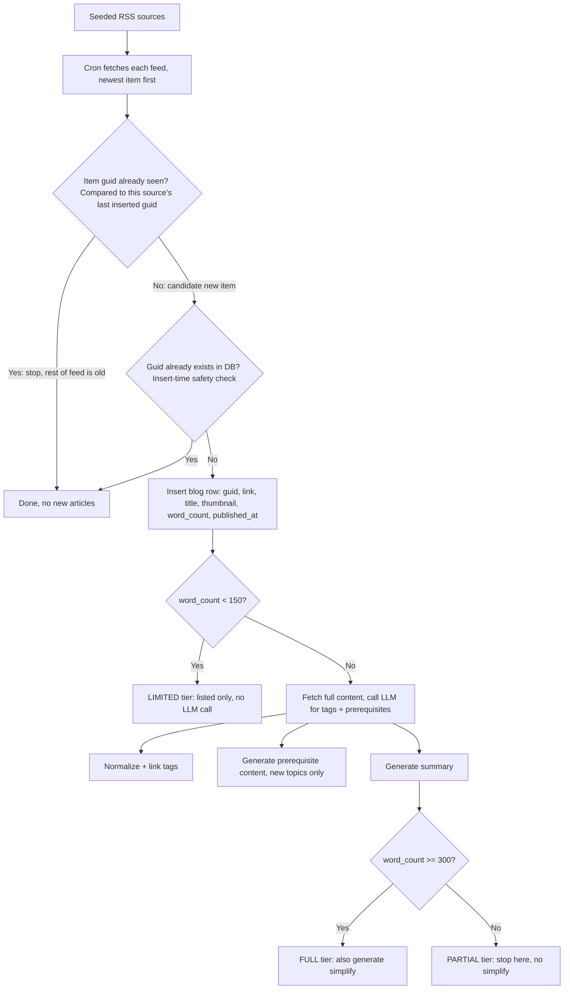

Given as a <a href="https://docs.google.com/presentation/d/1XXvdP4CADNGEt_O4Uhi9cxYPaVVxqJfu/edit?usp=sharing&ouid=101927937821898304665&rtpof=true&sd=true" target="_blank" rel="noopener noreferrer">talk</a> at a weekly tech meetup, August 28, 2026.

*Part 1 of a 4-part series on how EnggFeed, an RSS + LLM engineering blog aggregator, is built.*

[EnggFeed](https://enggfeed.mridulabs.dev) stands for Engineering Feed, RSS meets LLM, reviving the engineering feed.
RSS stands for Really Simple Syndication, an age-old tech. Started somewhere around the year 1999.
RSS feeds are in XML format. An article in the feed is called an item. A collection of items is referred to as a feed.
There are clients you can use to read the RSS feeds you're subscribed to. Some well known clients
are Feedly, Feeder, and so on.

Engineering feed is an engineering blog aggregator built using available RSS feeds from big tech giants
and some independent publishers. The reader can filter the blogs by company and tag at its core.

<iframe src="https://www.loom.com/embed/91de2c9faf00492a9dc929d8130fa616" title="EnggFeed demo" allowfullscreen></iframe>

## Constraints

Below is the list of constraints I had to work with. Taking these into account, I started building the product.

1. **Original blog post content cannot be stored**, since I'm not the author of the posts. This isn't just caution, courts have already ruled on it. In *MidlevelU v. Newstex*, the 11th Circuit held that publishing full articles through an RSS feed doesn't create an implied license to copy and republish them elsewhere. Subscribing to a feed only grants permission to read it through a reader, not to store or redistribute it. Sources at the bottom of this post.
2. **RSS feeds are dynamic.** Their content keeps changing: some feeds list 20 recent items, while others only list the 2 most recent.
3. **Every LLM call costs money.** Calls can happen on demand, or at ingest time with the result cached.
4. **Some RSS feeds don't give you full content for a blog.** LLMs hallucinate if the content is limited. I checked this on a couple of live feeds. Cloudflare's `<description>` tag is a short teaser while its `<content:encoded>` tag carries the full article, over a thousand words. Discord's feed has no `<content:encoded>` tag at all, only the short teaser. Same RSS format, very different amount of real content, which is exactly why the tiering below exists.

## Architecture

There are 2 flows.

## Data Flow

### Content Tiers

| Tier | Word Count | Features |
|------|------------|----------|
| LIMITED | < 150 | None, listed only, clicking redirects to the original blog post |
| PARTIAL | 150 to 299 | Tags, prerequisites, summary |
| FULL | 300 and above | Everything, including simplify (ELI5) |

> **Coming up in Part 2:** how EnggFeed's database schema evolved, including building a full Google OAuth login flow and then deleting it entirely.

## Resources

- [11th Circuit: No Implied License for RSS Scraping](https://www.plagiarismtoday.com/2021/03/08/11th-circuit-no-implied-license-for-rss-scraping/) (Plagiarism Today)
- [Subscription to RSS Feed Doesn't Trigger Implied-License Defense](https://www.ipupdate.com/2021/03/subscription-to-rss-feed-doesnt-trigger-implied-license-defense/) (IP Update)
- [Implied Copyright Licenses in the Digital World: Blogs, RSS Feeds, and Aggregators](https://www.mondaq.com/unitedstates/copyright/1047416/implied-copyright-licenses-in-the-digital-world-blogs-rss-feeds-and-aggregators) (Mondaq)
- [Are RSS Feeds Copyrighted?](https://aaronhall.com/are-rss-feeds-copyrighted/) (Aaron Hall, Attorney)

