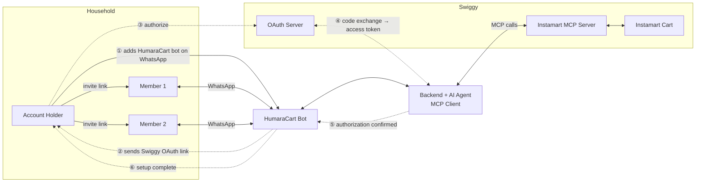

# HumaraCart: A Collaborative Household Instamart Assistant
### Swiggy Builders Club: Developer Program Application

*Created At: 25 April, 2026* *Last Edited At: 27 April, 2026* *Submitted At: 27 April, 2026*

---

## The Problem

In a shared household, everyone has needs but no one has full visibility. Person 1 orders milk not knowing Person 2 already ordered it. Person 3 forgets to tell anyone they used the last of the detergent. Items get duplicated, items get missed, and the coordination happens after the fact.

The problem is not Instamart. The problem is there is no shared layer, no single view of what the household needs. Each person is ordering in isolation.

---

## The Idea

Picture a WhatsApp group: three flatmates, one shared address. There is a fourth member in the group, HumaraCart, an AI agent.

Throughout the day, as people notice things running low, they just say it:

- Priya: `add milk`
- Rahul: `add detergent`
- Sneha: `add chips`
- Rahul: `remove detergent`
- Sneha: `show list`
- HumaraCart: `Current list: milk, chips`

HumaraCart maintains a running cart for the household. No one has to remember. No one has to open Instamart. When the list feels ready, any member nudges the account holder. The account holder gets a direct Instamart cart link, opens the app, and places the order themselves. That is it.

This is the vision.

---

## The Challenge

WhatsApp Business API does not natively support group bots. A bot cannot be added as a member of a WhatsApp group.

---

## The Workaround

Each household member has a 1:1 conversation with the bot. On the backend, all members are mapped to a shared household group ID. Every addition is reflected in one unified list. Members who opt in receive the updated list after every addition.

The user experience is identical to the group vision. The difference is only under the hood. This approach works fully within the official WhatsApp Business API. No unofficial libraries. No ToS risk.

---

## Why WhatsApp

WhatsApp is where Indian households already communicate. Any channel that requires a new app or a new habit creates drop-off before the product gets a chance. WhatsApp is not a technical convenience. It is where the user already is.

---

## System Overview

---

## How It Works

**Setup (done once by the account holder):**
- The account holder saves the HumaraCart number, initiates a chat, and links their existing Instamart account via OAuth. No new account needed.
- The bot generates a secure invite link. The account holder forwards this to other members.
- New members tap the link, WhatsApp opens, and the bot adds them to the household.
- The bot greets new members: *"Welcome to HumaraCart, powered by Swiggy Instamart. You have joined Priya's Household. Orders are fulfilled by Instamart via Priya's account. You do not need one."*
- Brand preferences are configured upfront for common items.

**Day-to-day usage:**
- Any member messages the bot: `add milk`, `add detergent 2`, `add chips`, `remove milk`, `show list`
- If quantity is missing, the bot asks: `How many?`
- If there is a brand conflict, the bot asks rather than assumes: `Which brand of milk?`
- The bot uses Swiggy's Instamart MCP tools to search items, resolve brands, and build the cart on behalf of the household.

**Ordering:**
- Any member can nudge the account holder: `ready to order`. The bot forwards it: *"Priya thinks the cart is ready. Want to review?"*
- The account holder sends `send cart link`. The bot sends a full summary of the current cart.
- The cart is already pre-populated on Instamart, built continuously via MCP as members added and removed items throughout the day.
- If a shareable cart link is available via the MCP or API, it is sent directly. Otherwise the account holder is notified to open Instamart where their cart is already populated.
- The account holder checks out on Instamart directly. The agent's job ends at cart creation.
- Delivery updates are shared with all household members via the bot.

**Household management:**
- New members can be added at any time via the invite link.
- Switching households creates a new group ID on the backend. Before creation, the backend checks if a household with the same members already exists to avoid duplicates.
- Households are fully isolated. No cross-household visibility.

> **Note:** Member removal is acknowledged as a necessary feature but is beyond the scope of this demo. It will be addressed in V2.

---

## Tech Stack

| Layer | Choice |
|-------|--------|
| Backend | Python, FastAPI |
| Agent Orchestration | LangGraph |
| MCP Client | Swiggy Instamart MCP |
| Swiggy APIs | TBD. Depends on what is available and exposed (e.g. shareable cart link, order tracking) |
| Messaging | WhatsApp Business API |
| Database | PostgreSQL |
| Infrastructure | Docker |
| Hosting | DigitalOcean |

The backend acts as the MCP client, receiving WhatsApp messages, resolving household context, and making Instamart MCP tool calls to search products and manage the shared cart. LangGraph orchestrates the stateful agent flows, handling multi-turn interactions like brand resolution and quantity confirmation. Household data, member mappings, and brand preferences are persisted in PostgreSQL.

---

## How We Plan to Use Swiggy Instamart MCP?

Our backend acts as the MCP Client. Every cart action is driven by Instamart MCP tool calls.

> **Note:** For a detailed step-by-step MCP tool call flow, see the sequence diagram [here](/swiggy-builders-club-application/humaraCart-sequence-diagram).

| Tool | Triggered When | What It Enables |
|------|---------------|-----------------|
| `search_products` | Member adds an item | Finds the right product on Instamart |
| `update_cart` | Item added or removed | Modifies the shared household cart |
| `get_cart` | After every cart change | Fetches current state to broadcast to all members |
| `checkout` | V3: agent places order on household's behalf | Used when auto-restock is enabled or account holder grants agent permission to order on approval |
| `track_order` | After order is placed | Fetches live order status for broadcast |
| `get_orders` | V2: purchase patterns | Enables reorder reminders based on history |

> **Open question for Swiggy:** Does the MCP or any API expose a shareable cart link?
> - **If yes:** Agent sends the cart link directly to the account holder via WhatsApp.
> - **If no:** Agent notifies the account holder: *"Cart link unavailable. Open Instamart, your cart is ready."*

---

## Security

**Invite system**
Invite links are signed with a short-lived JWT encoding the household ID and an expiry. Tokens are single-use and tamper-proof. Expired or reused tokens are rejected.

**Instamart OAuth**
The account holder links their Instamart account via OAuth. HumaraCart never handles credentials directly. It operates via an access token scoped to cart and order actions only.

**Household isolation**
All household data is scoped to a group ID on the backend. No member can access or influence another household's cart.

**Cart control stays with the account holder**
The bot only builds the cart. Checkout is always a manual action by the account holder. In V1 and V2, no order is ever placed without explicit confirmation.

---

## The Trust Arc

**V1: Collaborative Cart**
Agent builds the cart from household inputs. Account holder reviews and checks out via Instamart. Trust is established.

**V2: Household Intelligence**
- Agent learns from order history and identifies purchase patterns. Reminds: *"You usually buy milk every 5 days. It has been 4 days. Want to add it?"*
- Nudges the account holder when the cart has been idle: *"You have 5 items in your cart. Ready to order?"*
- Member removal: account holder can remove members from the household at any time.

**V3: Auto-Order (opt-in)**
Routine items can be set to auto-order for users who have explicitly granted the agent permission. Fully opt-in and item-specific.

Each stage earns the next. Trust is not assumed. It is built incrementally.

---

## Why This Matters for Swiggy

Most Instamart use cases optimise for the individual user. HumaraCart treats the **household as the unit**, which is how grocery shopping actually works in India.

- **Higher order value:** a cart built by 3-4 people is larger than a cart built by 1
- **Higher retention:** shared utility is stickier than individual utility; churning means letting your household down
- **Reduced browse friction:** users never open the app to search; the agent handles discovery via Swiggy's MCP tools
- **V3 auto-order:** routine household replenishment becomes a recurring GMV stream with zero active user effort

This is not a chatbot for Instamart. It is a new interface layer for how households shop.

---

*Built on Swiggy Instamart MCP | Contact: [mridubhatnagar](https://www.linkedin.com/in/mridu-bhatnagar-17703a92/)*
