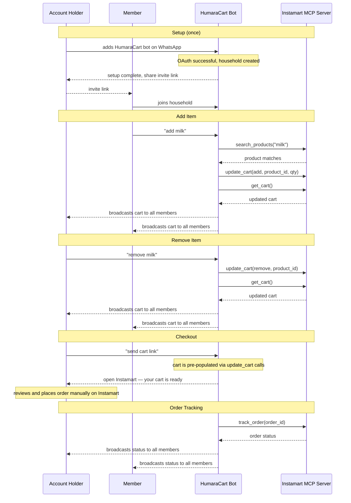

# HumaraCart: MCP Tool Call Flow

```mermaid
sequenceDiagram
    participant AH as Account Holder
    participant M as Member
    participant Bot as HumaraCart Bot
    participant MCP as Instamart MCP Server

    Note over AH,MCP: Setup (once)
    AH->>Bot: adds HumaraCart bot on WhatsApp
    Note over Bot: OAuth successful, household created
    Bot-->>AH: setup complete, share invite link
    AH-->>M: invite link
    M->>Bot: joins household

    Note over AH,MCP: Add Item
    M->>Bot: "add milk"
    Bot->>MCP: search_products("milk")
    MCP-->>Bot: product matches
    Bot->>MCP: update_cart(add, product_id, qty)
    Bot->>MCP: get_cart()
    MCP-->>Bot: updated cart
    Bot-->>AH: broadcasts cart to all members
    Bot-->>M: broadcasts cart to all members

    Note over AH,MCP: Remove Item
    AH->>Bot: "remove milk"
    Bot->>MCP: update_cart(remove, product_id)
    Bot->>MCP: get_cart()
    MCP-->>Bot: updated cart
    Bot-->>AH: broadcasts cart to all members
    Bot-->>M: broadcasts cart to all members

    Note over AH,MCP: Checkout
    AH->>Bot: "send cart link"
    Note over Bot: cart is pre-populated via update_cart calls
    Bot-->>AH: open Instamart — your cart is ready
    Note over AH: reviews and places order manually on Instamart

    Note over AH,MCP: Order Tracking
    Bot->>MCP: track_order(order_id)
    MCP-->>Bot: order status
    Bot-->>AH: broadcasts status to all members
    Bot-->>M: broadcasts status to all members
```
